## ToonTanks

### Create Pawn

Actor、Pawn、Character是层层继承的关系，这里我们创建一个BasePawn类作为坦克和炮台的基类

 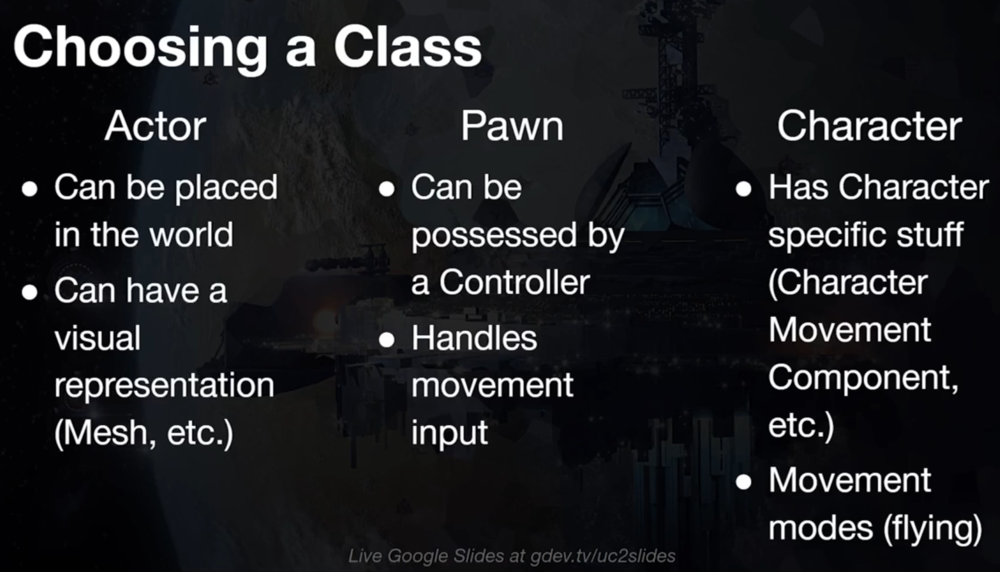

Components可以被添加到Actor，常见的Component如下：

 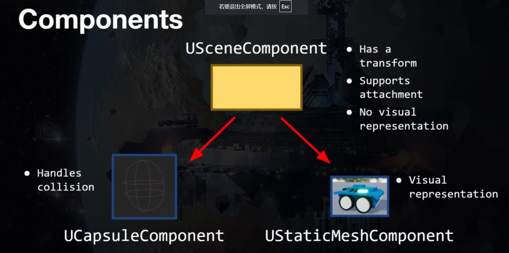

任何一个Actor的派生类都有一个`USceneComponent* RootComponent`，对于`Tank`对象，我们可以进行如下设计：RootComponent用一个Capsule替代，BaseMesh附加到Capsule中，TurretMesh附加到BaseMesh中

 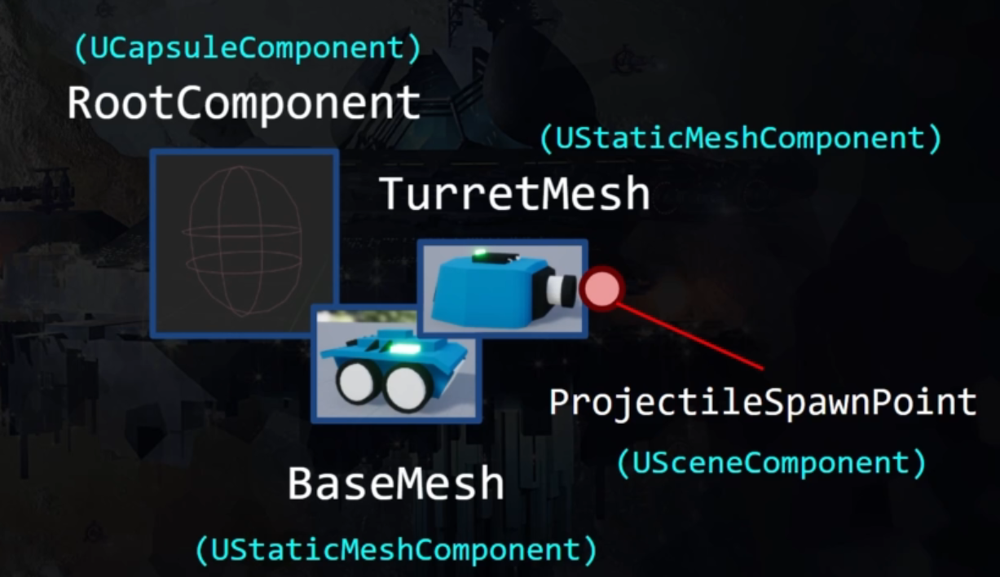

 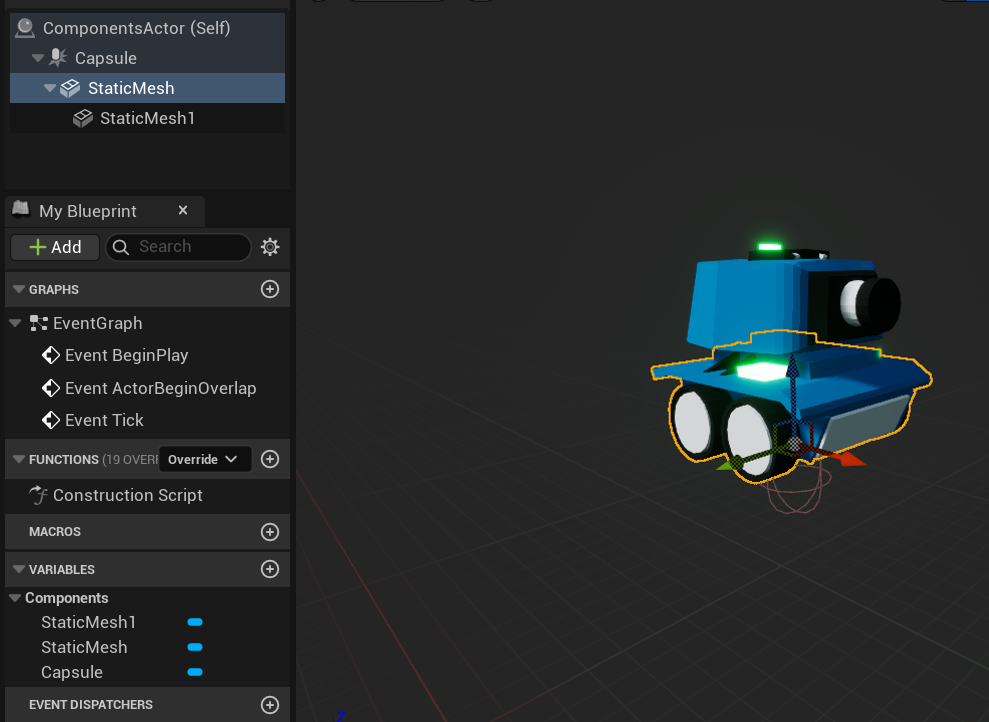

上面的操作可以在.cpp内完成，回到我们创建的BaseSpawn，我们使用`CreateDefaultSubobject`模板函数添加一个Component，并将使用`SetupAttachment`附加到其他组件。

```c++
class TOONTANKS_API ABasePawn : public APawn {
	GENERATED_BODY()

public:
	ABasePawn();

protected:
	virtual void BeginPlay() override;

public:	
	virtual void Tick(float DeltaTime) override;
	virtual void SetupPlayerInputComponent(class UInputComponent* PlayerInputComponent) override;
private:
	UPROPERTY()
	class UCapsuleComponent* CapsuleComp; // forward declaration

	UPROPERTY()
	UStaticMeshComponent* BaseMesh;

	UPROPERTY() 
	UStaticMeshComponent* TurretMesh;

	UPROPERTY()
	USceneComponent* ProjectileSpawnPoint;
};

ABasePawn::ABasePawn() {
	PrimaryActorTick.bCanEverTick = true;
	CapsuleComp = CreateDefaultSubobject<UCapsuleComponent>(TEXT("Capsule Collider"));
	RootComponent = CapsuleComp;

	BaseMesh = CreateDefaultSubobject<UStaticMeshComponent>(TEXT("Base Mesh"));
	BaseMesh->SetupAttachment(CapsuleComp);

	TurretMesh = CreateDefaultSubobject<UStaticMeshComponent>(TEXT("Turret Mesh"));
	TurretMesh->SetupAttachment(BaseMesh);

	ProjectileSpawnPoint = CreateDefaultSubobject<USceneComponent>(TEXT("Spawn Point"));
	ProjectileSpawnPoint->SetupAttachment(TurretMesh);
}

```

> **forward declaration**
>
> 通过使用 #include一些含有函数声明的头文件， 可以将函数声明加到你的当前 .cpp文件或 .h文件中，然而，这会拖慢编译时间。尤其是如果在.h文件中#include 头文件时。因为任何#include.h文件的文件，结局是都将#include所#include的头文件，编译器一下子需要编译无穷无尽的文件。为了避免这种情况，你可以使用前向声明。


### Deriving Blueprint classes

创建好BasePawn类后，我们就可以依据BasePawn创建蓝图类PawnTan和PawnTurret了。我们还需要将Components暴露给蓝图，使其可以在蓝图中被指定Mesh和修改属性

 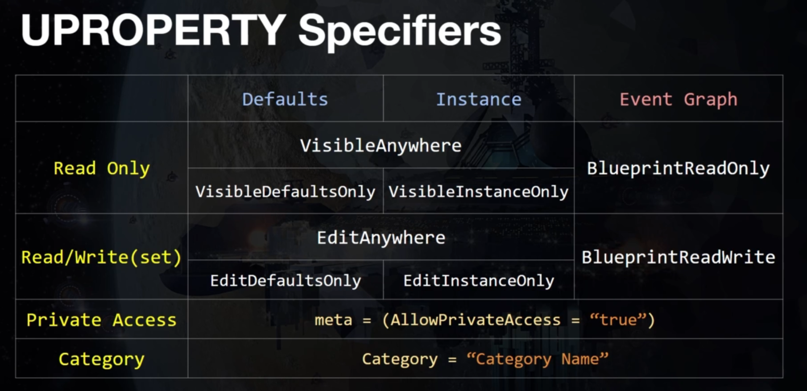

这里我们希望Component拥有以下权限：

```c++
UPROPERTY(VisibleAnywhere, Category = "Components", BlueprintReadOnly, meta = (AllowPrivateAccess = true))
```


### Handling Input

事实上Tank和Tower是有不同之处的，Tank需要被玩家控制，Tower需要由程序控制，因此我们要创建BasePawn的子类，然后在蓝图界面修改各自的Parent Class

Tank类需要借助`SpringArmComponent`和`CameraComponent`来控制

```c++
ATank::ATank() {
  SpringArm = CreateDefaultSubobject<USpringArmComponent>(TEXT("Spring Arm"));
  SpringArm->SetupAttachment(RootComponent);
  Camera = CreateDefaultSubobject<UCameraComponent>(TEXT("Camera"));
  Camera->SetupAttachment(SpringArm);
}
```

之后将Tank对象的`auto processor player`设置为`player 0`，然后要设置Axis Mappings，并将其绑定到Move函数（传递的参数就是下图中的Scale）

 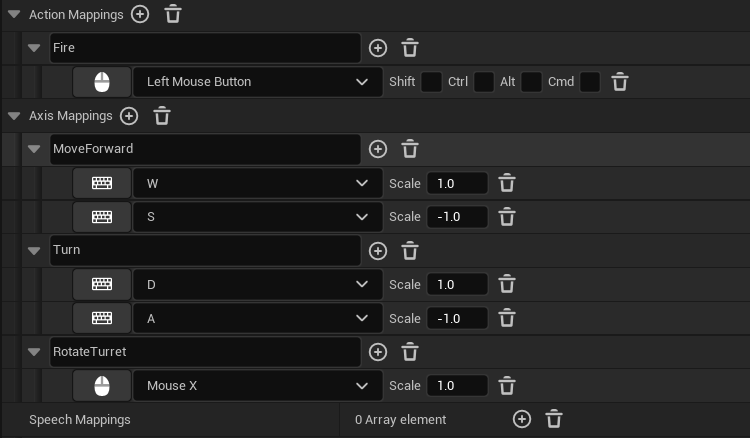

进行绑定的函数是`SetupPlayerInputComponent`，他是一个可重载的函数，对于PawnBase类我们不需要这个函数，可以删去，在Tank类，我们需要实现这个函数

```c++
void ATank::SetupPlayerInputComponent(UInputComponent* PlayerInputComponent) {
  Super::SetupPlayerInputComponent(PlayerInputComponent);
  PlayerInputComponent->BindAxis(TEXT("MoveForward"), this, &ATank::Move);
  PlayerInputComponent->BindAxis(TEXT("Turn"), this, &ATank::Turn);
}
```

任何一个Actor都有自己的local directions，整个world也有一个world directionss，我们对Actor进行移动时，希望的移动方向和旋转方向是和local directions相同的，可以使用`AddActorLocalOffset`和`AddActorLocalRotation`函数

```c++
void ATank::Move(float Value) {
  FVector DeltaLocation(0.f);
  DeltaLocation.X = Value;
  AddActorLocalOffset(DeltaLocation, true);
}

void ATank::Turn(float Value) {
  FRotator DeltaRotation = FRotator::ZeroRotator;
  DeltaRotation.Yaw = Value * TurnRate * UGameplayStatics::GetWorldDeltaSeconds(this);
  AddActorLocalRotation(DeltaRotation, true);
}
```

### Rotate Turret

为了控制光标来旋转Turret，我们需要获得Tank的Controller，我们需要的是`APlayerController`中的函数，但是`GetController`获得的是`Controller`对象，是`APlayerController`的父类，在ue5中可以使用Cast来安全进行向下转型

```c++
void ATank::BeginPlay() {
  Super::BeginPlay();
  PlayerController = Cast<APlayerController>(GetController());
}
```

`APlayerController`有`GetHitResultUnderCursor`函数获取光标的碰撞物体，减去Turret的WorldLocation就可以得到应该旋转的方向，我们只希望Turret绕着z轴旋转，因此最终旋转的Rotation中Pitch和Roll都为0

```c++
void ABasePawn::TurnTurret(FVector LookAtTarget) {
	FVector ToTarget = LookAtTarget - TurretMesh->GetComponentLocation();
	FRotator Rotation = FRotator(0.f, ToTarget.Rotation().Yaw, 0.f);
	TurretMesh->SetWorldRotation(Rotation);
}
```

```c++
void ATank::Tick(float DeltaTime) {
  Super::Tick(DeltaTime);

  UE_LOG(LogTemp, Display, TEXT("YES!!!"));

  if (PlayerController) {
    FHitResult HitResult;
    PlayerController->GetHitResultUnderCursor(
      ECollisionChannel::ECC_Visibility,
      false,
      HitResult
    );

    TurnTurret(HitResult.ImpactPoint);
  eqw
}
```


### Tower

同样从BasePawn继承一个Tower类，当Tank进入射程内时，需要定位Tank，获取TankPawn可以使用`UGameplayStatics::GetPlayerPawn`函数，这里要注意Tank的初始化要放在`BeginPlay`中，不能放在构造函数中

```c++
void ATower::BeginPlay() {
  Super::BeginPlay();
  Tank = Cast<ATank>(UGameplayStatics::GetPlayerPawn(GetWorld(), 0));
}

void ATower::Tick(float DeltaTime) {
  Super::Tick(DeltaTime);
  if (Tank) {
    FVector TankLocation = Tank->GetActorLocation();
    if (FVector::Dist(GetActorLocation(), TankLocation) <= FireDistance) {
      TurnTurret(TankLocation);
    }
  }
}
```


### Fire

Fire是基类的功能，因为Tank和Tower都可以Fire

```c++
void ABasePawn::Fire() {
	FVector SpawnLocation = ProjectileSpawnPoint->GetComponentLocation();

	DrawDebugSphere(
		GetWorld(),
		SpawnLocation,
		30,
		30,
		FColor::Red,
		false,
		3
	);
}
```

Tank的Fire同样需要绑定，但Fire是一种Action Mapping，绑定方法和Axis Mapping相似

```c++
PlayerInputComponent->BindAction(TEXT("Fire"), IE_Pressed, this, &ATank::Fire);
```

Tower需要定期检查Tank是否在射程内，如果在就发射炮弹，因此我们需要一个`Timer`去定期检查并调用`Fire`函数

 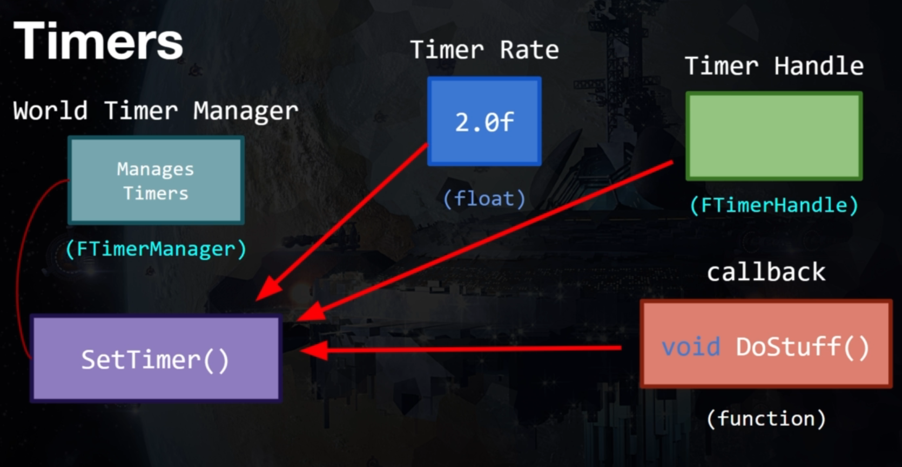

```c++
void ATower::BeginPlay() {
  Super::BeginPlay();
  Tank = Cast<ATank>(UGameplayStatics::GetPlayerPawn(GetWorld(), 0));
  GetWorldTimerManager().SetTimer(FireTimeHandler, this, &ATower::CheckFireCondition, FireRate, true);
}

void ATower::CheckFireCondition() {
  if (InFireDistance()) {
    Fire();
  }
}
```


### Projectile

Projectile是一个Actor类，我们可以使用`SpawnActor`函数生成，但是`SpawnActor`需要传入的参数`UClass`应该是一个蓝图对象，否则发射出的子弹不会有StaticMesh，在C++中想调用基于C++的蓝图类需要使用`TSubclassOf<>`

 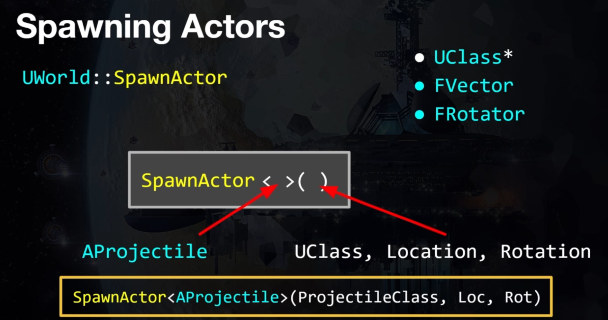

 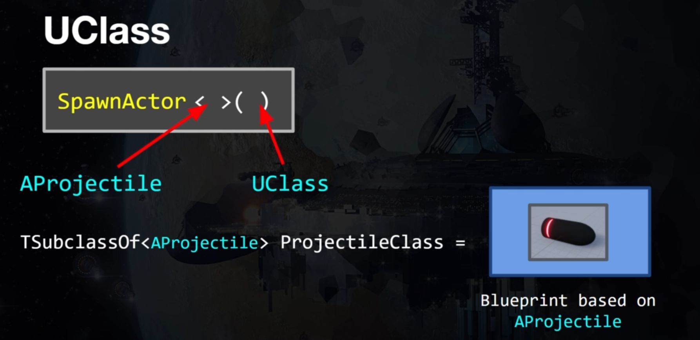

```c++
UPROPERTY(EditDefaultsOnly, Category = "Combat");
TSubclassOf<class AProjectile> ProjectileClass;
```

然后去蓝图界面设置Projectile Class，就可以发射出蓝图类的Projectile

 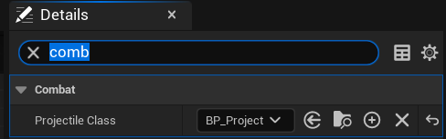

```c++
void ABasePawn::Fire() {
	FVector SpawnLocation = ProjectileSpawnPoint->GetComponentLocation();
	FRotator SpawnRotation = ProjectileSpawnPoint->GetComponentRotation();
	GetWorld()->SpawnActor<AProjectile>(ProjectileClass, SpawnLocation, SpawnRotation);
}
```

UE5中自带`UProjectileMovementComponent`可以控制子弹的发射

```c++
AProjectile::AProjectile() {
	PrimaryActorTick.bCanEverTick = true;
	ProjectileMesh = CreateDefaultSubobject<UStaticMeshComponent>(TEXT("Projectile Mesh"));
	RootComponent = ProjectileMesh;

	ProjectileMovement = CreateDefaultSubobject<UProjectileMovementComponent>(TEXT("Projectile Movement"));
	ProjectileMovement->MaxSpeed = 1200;
	ProjectileMovement->InitialSpeed = 1200;
}
```

接下来要处理碰撞事件，`UPrimitiveComponent`自带`OnComponentHit`，`OnComponentHit` 是一个与物理碰撞相关的事件，当一个 **Primitive Component**（如 `StaticMeshComponent`、`BoxComponent` 等）与其他物体发生物理碰撞时，该事件会被触发。当事件触发时，会传递以下关键参数：

- **`HitComponent`**：被碰撞的组件（自身）。
- **`OtherComponent`**：与之碰撞的另一组件。
- **`SelfVelocity`** 和 **`OtherVelocity`**：碰撞时双方的线速度。
- **`NormalImpulse`**：碰撞的法线方向冲量。
- **`HitResult`**：包含碰撞的详细信息（如碰撞点、法线方向、碰撞对象等）。

 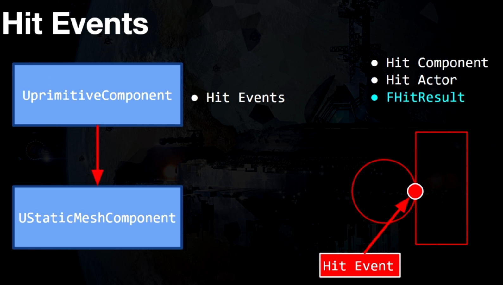

 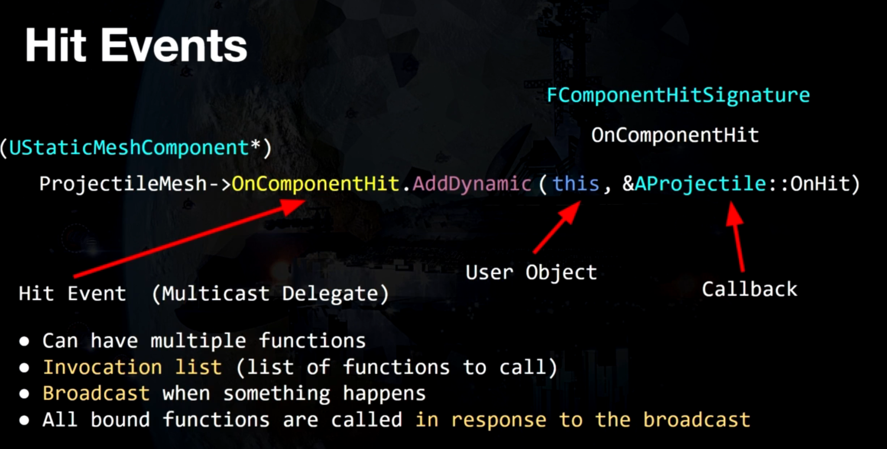

首先定义一个回调函数，**`OnComponentHit.AddDynamic()`** 这类动态绑定方法，要求回调函数必须是一个 **`UFunction`**（通过反射生成的函数类型）。

```c++
UFUNCTION()
void OnHit(UPrimitiveComponent* HitComp, AActor* OtherActor, UPrimitiveComponent* OtherComp, FVector NormalImpusle, const FHitResult& Hit);
```

```c++
void AProjectile::BeginPlay() {
	Super::BeginPlay();
	ProjectileMesh->OnComponentHit.AddDynamic(this, &AProjectile::OnHit);	
}
```


### Health Component

`Health Component`应该设置为一个`ActorComponent`，ue5中也有内置的伤害函数，OnTakeAnyDamage也是一种Delegate，用于检测造成伤害的事件

 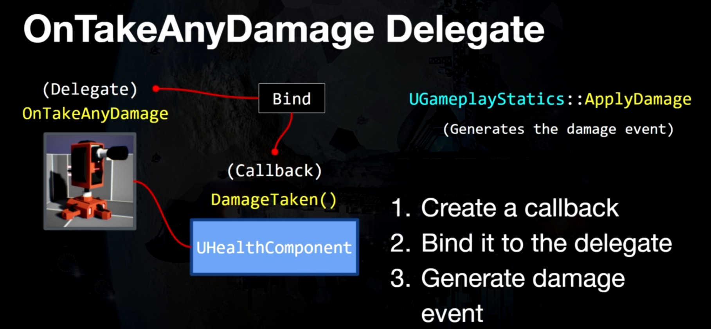

```c++
UFUNCTION()
void DamageTaken(AActor* DamagedActor, float Damage, const UDamageType* DamageType, class AController* Instigator, AActor* DamageCauser);

void UHealthComponent::BeginPlay() {
	Super::BeginPlay();
	Health = MaxHealth;
	GetOwner()->OnTakeAnyDamage.AddDynamic(this, &UHealthComponent::DamageTaken);
}
```

当检测到造成伤害时，`OnTakeAnyDamage`就会调用回调函数

接下来要设置造成伤害事件的函数，需要传入以下参数，为了获得`Instigator`即造成伤害对象的Controller，我们需要先将Projectile绑定Owner

 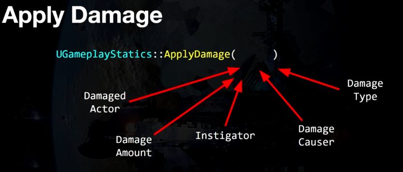

```c++
void ABasePawn::Fire() {
	FVector SpawnLocation = ProjectileSpawnPoint->GetComponentLocation();
	FRotator SpawnRotation = ProjectileSpawnPoint->GetComponentRotation();
	auto Projectile = GetWorld()->SpawnActor<AProjectile>(ProjectileClass, SpawnLocation, SpawnRotation);
	Projectile->SetOwner(this);
}
```

然后在Projectile类中设置`ApplyDamage`函数，当`OnHit`事件发生时，调用造成伤害事件，OnTakeAnyDamage检测到造成了伤害，调用`DamageTaken`

```c++
void AProjectile::OnHit(UPrimitiveComponent* HitComp, AActor* OtherActor, UPrimitiveComponent* OtherComp, FVector NormalImpusle, const FHitResult& Hit) {
	auto Owner = GetOwner();
	if (Owner && OtherActor && OtherActor != this && OtherActor != Owner) { 
		UGameplayStatics::ApplyDamage(OtherActor, Damage, Owner->GetInstigatorController(), this, DamageType);
		Destroy(); // 造成伤害后销毁子弹
	}
}
```


### GameMode

接下来我们需要创建自己的游戏模式，创建一个`ToonTanksGameMode`类，并基于此创建一个蓝图。

我们的游戏规则时当一个Pawn生命值为0时销毁，整个流程如图所示

 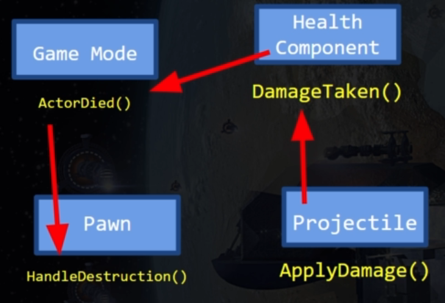

```c++
void ABasePawn::HandleDestruction() {
  // 设定Pawn死亡时的一些特效
}

void ATank::HandleDestruction() {
  Super::HandleDestruction();
  SetActorHiddenInGame(true);
  SetActorTickEnabled(false);
}

void ATower::HandleDestruction() {
  Super::HandleDestruction();
  Destroy();
}
```

GameMode中处理死亡

```c++
void AToonTanksGameMode::ActorDied(AActor* DiedActor) {
  if (DiedActor == Tank) {
    Tank->HandleDestruction();
    if (Tank->GetPlayerController()) {
      Tank->DisableInput(Tank->GetPlayerController());
      Tank->GetPlayerController()->bShowMouseCursor = false;
    }
  }
  else if (ATower* Tower = Cast<ATower>(DiedActor)) {
    Tower->HandleDestruction();
  }
}

void AToonTanksGameMode::BeginPlay() {
  Super::BeginPlay();
  Tank = Cast<ATank>(UGameplayStatics::GetPlayerPawn(this, 0));
}
```

HealthComponent判断是否死亡

```c++
void UHealthComponent::BeginPlay() {
	Super::BeginPlay();
	Health = MaxHealth;
	GetOwner()->OnTakeAnyDamage.AddDynamic(this, &UHealthComponent::DamageTaken);
	ToonTanksGameMode = Cast<AToonTanksGameMode>(UGameplayStatics::GetGameMode(this));
}

void UHealthComponent::DamageTaken(AActor* DamagedActor, float Damage, const UDamageType* DamageType, class AController* Instigator, AActor* DamageCauser) {
	if (Damage <= 0.f) return;
	Health -= Damage;
	if (ToonTanksGameMode && Health <= 0) {
		ToonTanksGameMode->ActorDied(DamagedActor);
	}
}
```

我们也可以自定义自己的Player Controller类来控制Controller


接下来我们设定开始游戏时的准备工作，我们希望延迟一定时间后开始游戏，可以使用`SetTime`r另一个重载函数

 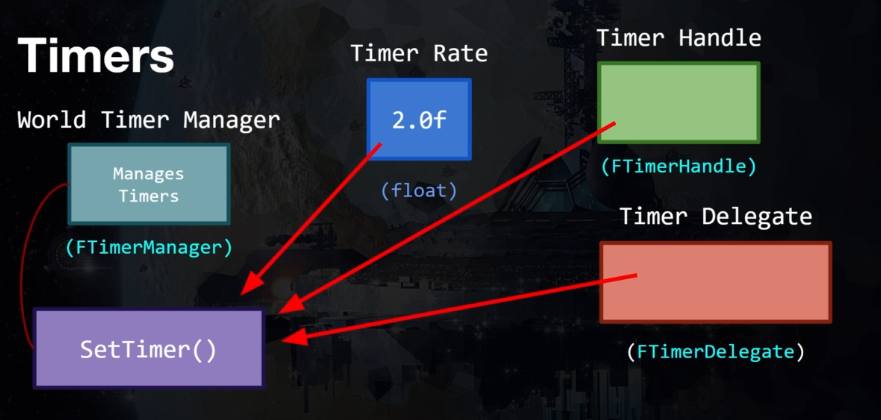

 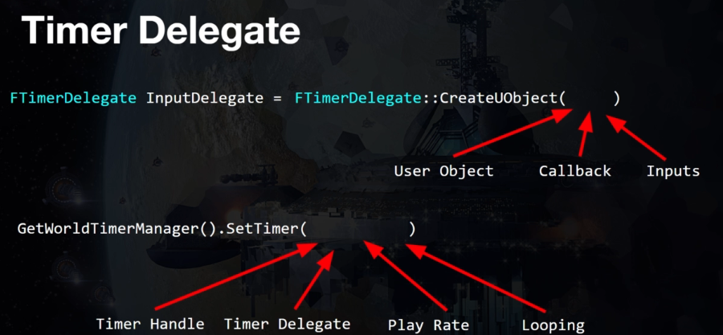

```c++
void AToonTanksGameMode::HandleGameStart() {
  Tank = Cast<ATank>(UGameplayStatics::GetPlayerPawn(this, 0));
  ToonTanksPlayerController = Cast<AToonTanksPlayerController>(UGameplayStatics::GetPlayerController(this, 0));

  if (ToonTanksPlayerController) {
    ToonTanksPlayerController->SetPlayerEnabledState(false);

    FTimerHandle TimerHandle;
    FTimerDelegate TimerDelegate = FTimerDelegate::CreateUObject(
      ToonTanksPlayerController,
      &AToonTanksPlayerController::SetPlayerEnabledState,
      true
    );
    GetWorldTimerManager().SetTimer(TimerHandle, TimerDelegate, StartDelay, false);
  }
}
```


### CreateWidget

现在我们希望游戏开始时在屏幕上显示一些东西，首先创建一个Widget Blueprint

 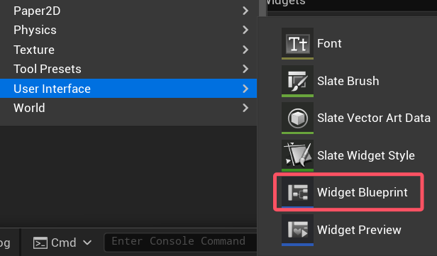

然后我们需要创建一个蓝图可实现函数，这样就可以在蓝图中实现该c++函数并在c++中调用

```c++
UFUNCTION(BlueprintImplementableEvent)
void StartGame();
```

 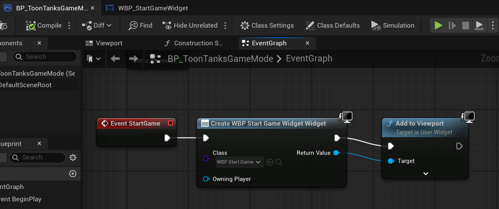

接着设计我们的倒计时Widget，在设计界面将文本框设置成变量

 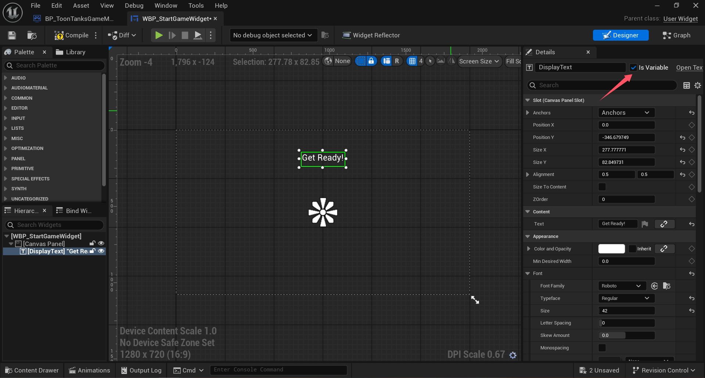

然后在graph界面设置事件

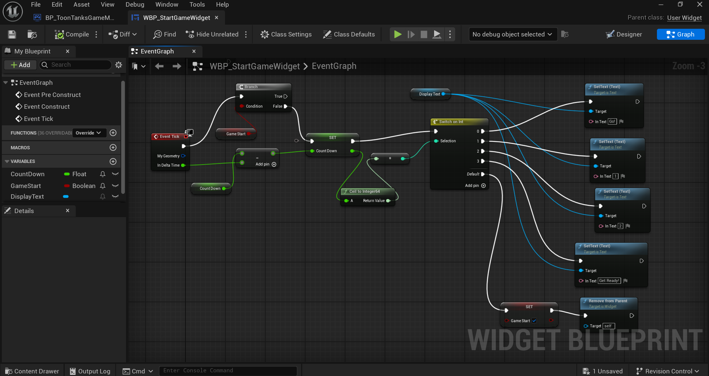


### GameOver

可以使用`UGameplayStatics::GetAllActorsOfClass`来获取某个对象的个数

 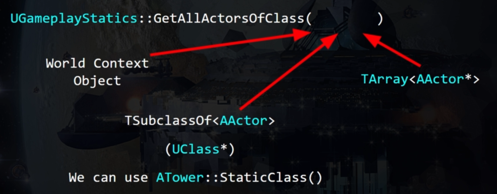

```c++
int32 AToonTanksGameMode::GetTowerCount() {
  TArray<AActor*> Towers;
  UGameplayStatics::GetAllActorsOfClass(this, ATower::StaticClass(), Towers);
  return Towers.Num();
}
```

在游戏开始时获得Tower的数量，然后就可以在ActorDied中判断是否获胜

```c++

void AToonTanksGameMode::ActorDied(AActor* DiedActor) {
  if (DiedActor == Tank) {
    Tank->HandleDestruction();
    if (ToonTanksPlayerController) { 
      ToonTanksPlayerController->SetPlayerEnabledState(false);
    }
    GameOver(false);
  } else if (ATower* Tower = Cast<ATower>(DiedActor)) {
    Tower->HandleDestruction();
    if (--TowerCount) {
      GameOver(true);
    }
  }
}
```

再在蓝图中实现GameOver函数的逻辑

 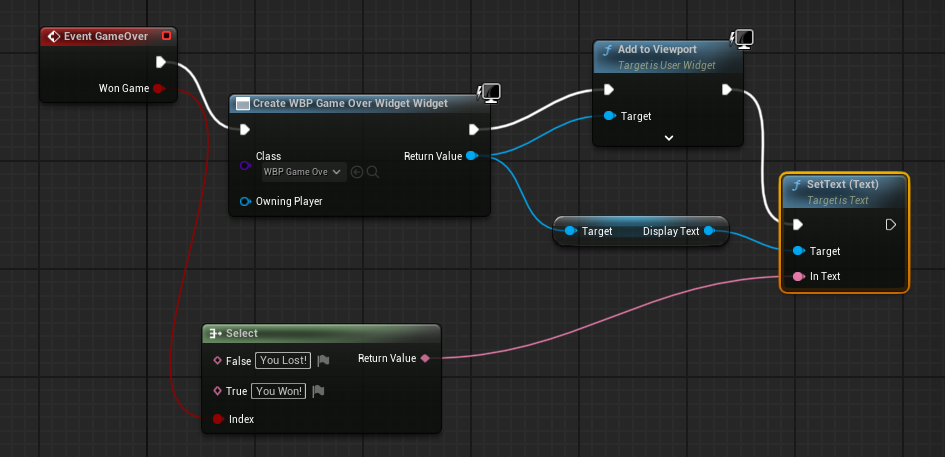


### Polish

首先处理射击特效、死亡特效和声音特效，可以使用`UGameplayStatics::SpawnEmitterAtLocation`和`UGameplayStatics::PlaySoundAtLocation`

```c++
UPROPERTY(EditAnywhere, Category = "Combat")
UPROPERTY(EditAnywhere, Category = "Combat")
class UParticleSystem* HitParticles;

UPROPERTY(VisibleAnywhere, Category = "Combat")
class UParticleSystemComponent* SmokeTrail;

UPROPERTY(EditAnywhere, Category = "Combat")
class USoundBase* LaunchSound;

UPROPERTY(EditAnywhere, Category = "Combat")
USoundBase* HitSound;


void AProjectile::OnHit(UPrimitiveComponent* HitComp, AActor* OtherActor, UPrimitiveComponent* OtherComp, FVector NormalImpusle, const FHitResult& Hit) {
	auto MyOwner = GetOwner();
	if (MyOwner && OtherActor && OtherActor != this && OtherActor != MyOwner) {
		UGameplayStatics::ApplyDamage(OtherActor, Damage, MyOwner->GetInstigatorController(), this, UDamageType::StaticClass());
		if (HitParticles) {
      UGameplayStatics::SpawnEmitterAtLocation(GetWorld(), HitParticles, GetActorLocation(), GetActorRotation());
		}
		if (HitSound) {
			UGameplayStatics::PlaySoundAtLocation(this, HitSound, GetActorLocation());
		}
	}
  Destroy();
}

```

接下来是Smoke Trail，Smoke Trail是一种`UParticleSystemComponent`，可以像之前构造Tank一样添加到Projectile类

  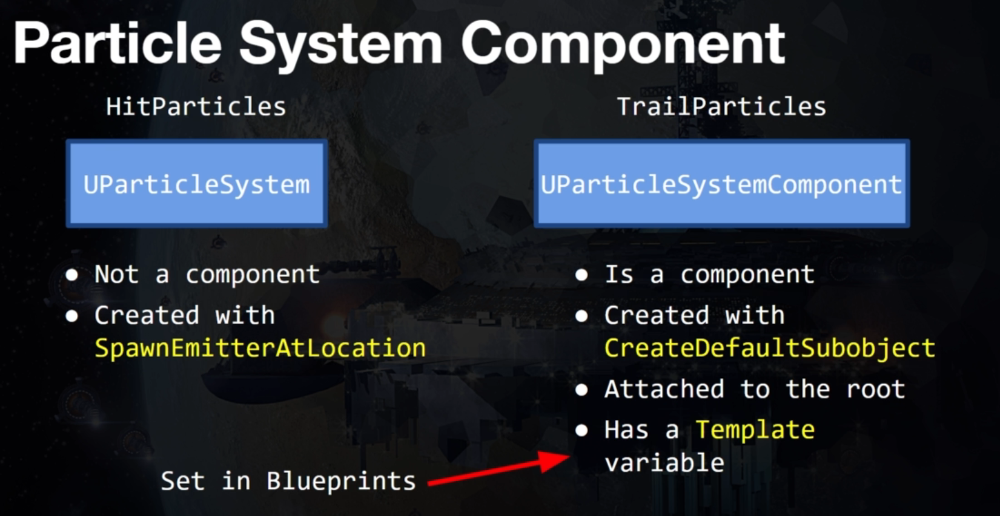

```c++
SmokeTrail = CreateDefaultSubobject<UParticleSystemComponent>(TEXT("Smoke Trail"));
SmokeTrail->SetupAttachment(RootComponent);
```

 接下来是CamreShake，需要使用`PlayerController`中的方法

```c++
UPROPERTY(EditAnywhere, Category = "Combat")
TSubclassOf<class UCameraShakeBase> HitCameraShakeClass;

void AProjectile::OnHit(UPrimitiveComponent* HitComp, AActor* OtherActor, UPrimitiveComponent* OtherComp, FVector NormalImpusle, const FHitResult& Hit) {
	auto MyOwner = GetOwner();
	if (MyOwner && OtherActor && OtherActor != this && OtherActor != MyOwner) {
		UGameplayStatics::ApplyDamage(OtherActor, Damage, MyOwner->GetInstigatorController(), this, UDamageType::StaticClass());
		if (HitParticles) {}
		if (HitSound) {}
		if (HitCameraShakeClass) {
			GetWorld()->GetFirstPlayerController()->ClientStartCameraShake(HitCameraShakeClass);
		}
	}
  Destroy();
}
```

我们希望移动镜头变得平滑一些，可以设置Camera Arm的Lag

 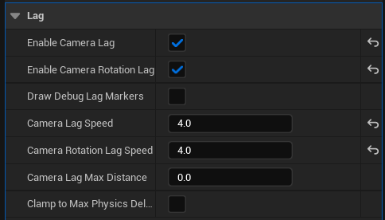
